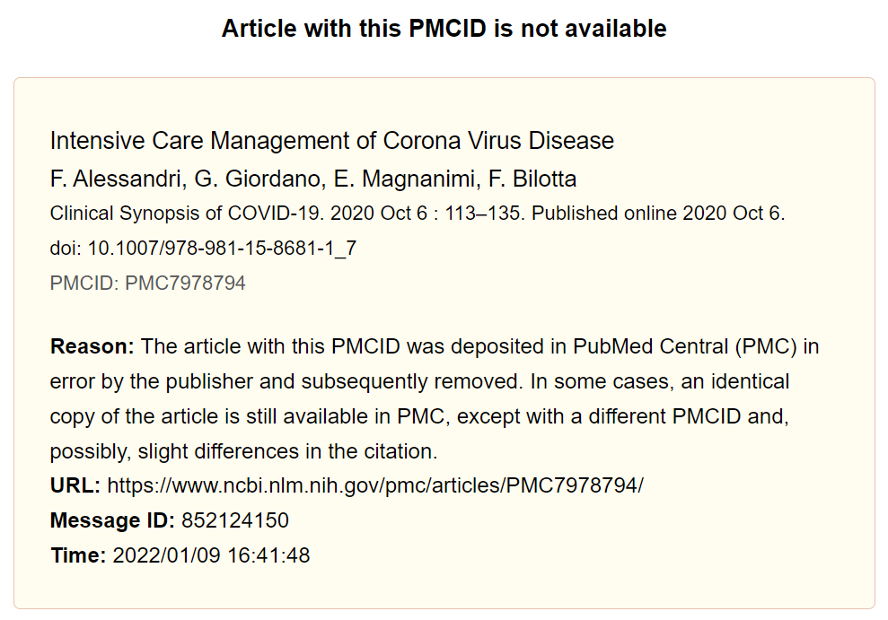
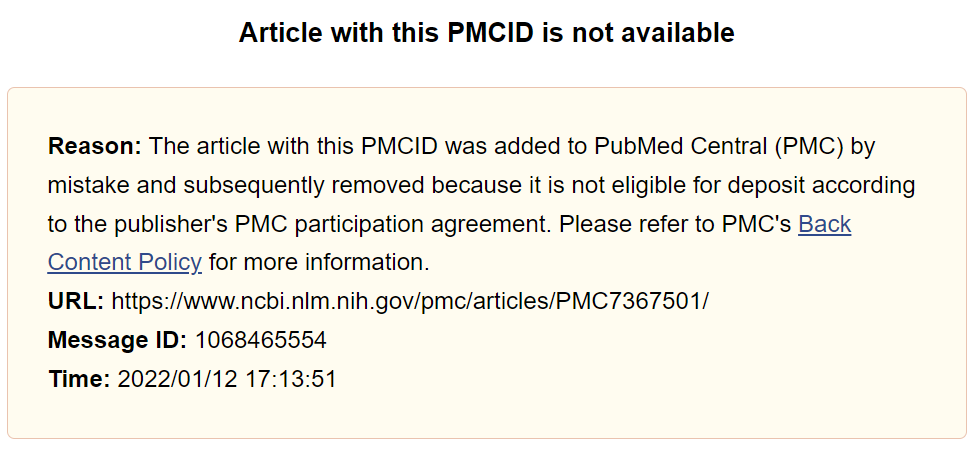
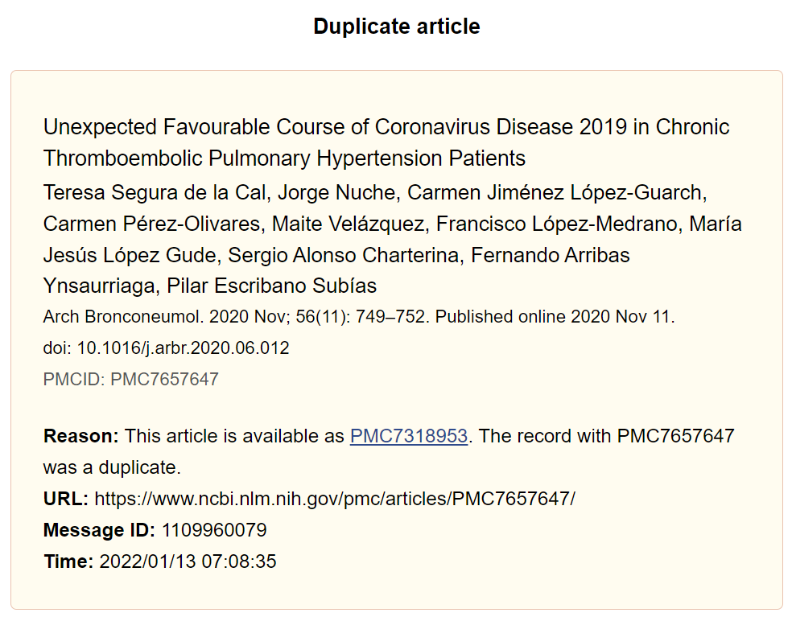
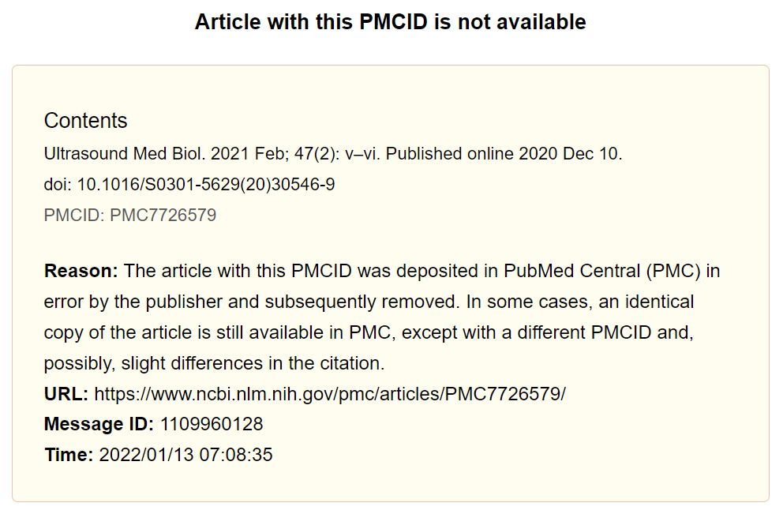

# COVID-19 PMC collections
Licences and permanence of COVID19 Public Health Emergency collections in PubMed Central (PMC)

last update: November 12, 2021

## Public Health Emergency COVID-19 Initiative
In response to a [call from National Science and Technology Advisors from a dozen countries](https://wellcome.ac.uk/sites/default/files/covid19-open-access-letter.pdf), a [number of publishers](https://wellcome.ac.uk/press-release/publishers-make-coronavirus-covid-19-content-freely-available-and-reusable) have committed to making their coronavirus-related articles freely available through PubMed Central and other public repositories, and facilitate text mining and secondary analysis through machine-readable formats and licenses. 

Publisher collections made available in PMC as part of this [Public Health Emergency COVID-19 Initiative](https://www.ncbi.nlm.nih.gov/pmc/about/covid-19/) are listed as part of the PMC [special collections]( https://www.ncbi.nlm.nih.gov/pmc/journals/collections/?titles=current&search=journals). 

## Licenses and permanence
One outstanding question is under which licenses these papers are made available, and especially, to what extent they are to be a permanent part of PubMed Central, or are subject to withdrawal after the (immediate) urgency of the COVID19 public health emergency has passed. 

In the [FAQ](https://www.ncbi.nlm.nih.gov/pmc/about/covid-19-faq/) of the PMC COVID-19 Initiative, it is stated that articles which are not made available under a [Creative Commons](https://creativecommons.org/)-license, <em>"will include a custom license that allows for the article to be made available via the PMC Open Access Subset for re-use and secondary analysis with acknowledgement of the original source"</em>. For such articles, the National Library of Medicine (NLM) proposes a license that includes a perpetual license to PMC to make the article available, even when permissions for unrestricted re-use and analysis are withdrawn

>"This article is made available via the PMC Open Access Subset for unrestricted re-use and analyses in any form or by any means with acknowledgement of the original source. These permissions are granted for the duration of the COVID-19 pandemic or until permissions are revoked in writing. Upon expiration of these permissions, PMC is granted a perpetual license to make this article available via PMC and Europe PMC, consistent with existing copyright protections."

However, the FAQ also makes clear that when a copyright holder decides to use another license and requests content be removed from the archive at the end of the initiative, PMC will remove the content. 

## Analyzing licenses of publisher collections in the PMC COVID-19 Initative

So which licenses are used by publishers for content in the PMC COVID-19 initiative? License information of articles in publisher collections in the PMC COVID-19 Initiative was retrieved programmatically though the [Entrez Programming Utilities](https://www.ncbi.nlm.nih.gov/books/NBK25499/), using the R package [rentrez](https://cran.r-project.org/web/packages/rentrez/index.html) on **Nov 1-2, 2021** (with the exception of data for SpringerNature, which were recollected on Nov 11, 2021 to correct an error). Programmatic classification of licenses was supplemented by manual inspection of the license statements. Scripts and data are shared in this GitHub repo. Results are summarized in Table 1 below.  

The data would also allow for analysis of licenses for individual publisher imprints and/or societies that publish with one of the large publishers, or for analysis at the level of journal titles.   

Only publications included in PMC [special collections](https://www.ncbi.nlm.nih.gov/pmc/journals/collections/?titles=current&search=journals) that are identified as Public Health Emergency collections were included, so contributions from other publishers might have been missed. 

|PMC Public Health Emergency collection|number of papers (2021-11-01*)|CC license|CC-BY|open government license|custom license (perpetual access via PMC)|custom license (temporary access)|custom license (other)|unknown|
|--------------------------------------|:---------------------------:|:--------:|:---:|:---------------------:|:---------------------------------------:|:-------------------------------:|:--------------------:|:-----:|
| AAAS | 182 | 173 | 173 | - | - | - | 8 | 1 |
| American College of Physicians | 300 | - | - | - | 300 | - | - | - |
| ACS | 789 | 84 | 38 | - | - | 675 | 26 | 4 |
| AOSIS | 200 | 200 | 200 | - | - | - | - | - |
| ASME | 22 | - | - | - | 22 | - | - | - |
| BMJ | 2073 | 1535 | 269 | - | - | 523 | - | 15 |
| Cambridge University Press | 2254 | 1726 | 1715 | - | 518 | 3 | - | 7 |
| Elsevier | 77218 | 4962 | 1087 | - | 57 | 70842 | 22 | 1335 |
| IEEE | 79 | 67 | 67 | - | - | - | - | 12 |
| IOP | 42 | - | - | - | - | 42 | - | - |
| JMIR | 44 | 44 | 44 | - | - | - | - | - |
| Karger | 592 | 95 | 5 | - | 428 | - | - | 69 |
| NEJM | 271 | - | - | - | 182 | - | - | 89 |
| Oxford University Press | 11369 | 2931 | 880 | 210 | 4005 | 115 | 3961 | 147 |
| Radiological Society | 228 | 1 | 1 | - | 221 | - | - | 6 |
| Sage | 899 | 889 | 691 | - | 1 | - | - | 9 |
| Springer Nature* | 69044 | 21819 | 21073 | 1 | - | 44406 | 18 | 2800 |
| Taylor & Francis | 858 | 80 | 34 | - | 706 | - | 2 | 70 |
| Thieme | 357 | 57 | 2 | - | 298 | - | - | 2 |
| University of Toronto Press | 24 | - | - | - | 24 | - | - | - |
| Wiley | 18645 | 2851 | 1492 | - | 171 | 14985 | 148 | 490 |
| Wolters Kluwer | 2284 | 400 | 90 | 7 | 1856 | - | 1 | 20 |

**Table 1.  Numbers of articles in publisher collections in PMC COVID-19 Initiave with different types of licenses (NB numbers for CC-license include CC-BY) \*Springer Nature data collected 2021-11-11.**
 

The analysis shows that only a minority of papers shared in the COVID-19 Initiative have a CC-license (and only a subset of those a CC-BY license). For papers that are not shared with a CC-license, some publishers (e.g. <em>Cambridge University Press</em>, <em>Oxford University Press</em>, <em>Taylor & Francis</em> and <em>Wolters Kluwer</em>) have opted to use a license as described above, guaranteeing perpetual access through PMC (even after other reuse permissions are withdrawn). Other publishers (e.g. <em>BMJ</em>, <em>ACS</em>, <em>Elsevier</em>, <em>IOP</em>, <em>Springer Nature</em> and <em>Wiley</em>) use a custom license that specifies that access to these papers is temporary. Two examples of such licenses are quoted below: 

>"Since January 2020 Elsevier has created a COVID-19 resource centre with free information in English and Mandarin on the novel coronavirus COVID-19. The COVID-19 resource centre is hosted on Elsevier Connect, the company's public news and information website. Elsevier hereby grants permission to make all its COVID-19-related research that is available on the COVID-19 resource centre - including this research content - immediately available in PubMed Central and other publicly funded repositories, such as the WHO COVID database with rights for unrestricted research re-use and analyses in any form or by any means with acknowledgement of the original source. These permissions are granted for free by Elsevier for as long as the COVID-19 resource centre remains active." [<em>Elsevier</em>]  

>"This article is made available via the PMC Open Access Subset for
unrestricted research re-use and analyses in any form or by any
means with acknowledgement of the original source. These
permissions are granted for the duration of the World Health
Organization (WHO) declaration of COVID-19 as a global
pandemic." [<em>Springer Nature</em>] 

## Implications
That many COVID-19 related research papers are currently made publicly available, both for reading and for analysis and (re)use, is in itself a positive development. Their full-text inclusion in PubMed Central allows for a centralized access point, subsequent inclusion in other databases such as [Europe PMC](https://europepmc.org/) and the [CORD-19 dataset](https://pages.semanticscholar.org/coronavirus-research), and further downstream usage. At the same time, the fact that many of these publictions carry licenses that in some ways restrict further sharing and reuse (e.g. CC-BY-NC-ND instead of CC-BY), only allow unlimited reuse and analysis for a limited time, or even allow reading access for a limited time only, points to the limitations of this model. 

It will remain to be seen whether publishers will indeed request removal of articles from PMC in the future, e.g. after the WHO declares the pandemic to be over (e.g. Springer Nature) and/or after the publishers themselves decide to close their COVID-19-related resource initiatives (e.g. Elsevier). 

One final question is whether there is **precedence of content being made available through PMC on a temporary basis**, and what this means for the status of open access articles ma/de available through PMC, e.g. in assessing types and levels of open access over time.

-----

## Evidence of records removed from PMC (November 2021)

The availability of a longitudinal dataset of records in the PMC Public Health Emergency collections allows for monitoring of removal of records from these collections. The snapshot taken in November 2021 for the first time revealed sizeable numbers of records that were removed from PubMed Central, most notably by three publishers: SpringerNature (n=3549 records), NEJM (n=167) and Elsevier (n=183).

Longitudinal data on all records (including removal status) is available as [csv file](ouput/records_all_unique.csv). For records for which DOIs are available in the dataset (either directly taken from PMC at time of sampling, or later retrieved from the CORD19 dataset), additional information on publication type, date of publication and (through Unpaywall) [open access status at time of sampling](data/Unpaywall/PMC_all_UPW_instances_2021-11-17.csv) is also available. Summary statistics of removed records are available as [json file](output/removed_records/removed_records_analysis.json).

### SpringerNature - over 3000 book chapters removed
Information on DOIs is available for 3396 of 3549 (96%) of removed records. Almost all of these (n=3372, 99%) concern *book chapters*. In total, 31% of all book chapters (n=10,828) made available by SpringerNature in the PMC Public Health Emergency Collection were found to be removed, from 872 of 3419 titles. For 837 of these 872 titles, all chapters previously available in the PMC Public Health Collection were removed. 

Removed chapters are from titles published between 2005 and 2021, with the majority from 2020 (n=2447) and 2021 (n=843). Most (n=3275) were added to PMC in March 2021, and removed between 2021-05-30 (previous sample date) and 2021-11-11 (current sample date for SpringerNature records). 

Almost all removed chapters (3359 of 3372, 99.6%) had been made available on PMC with a custom license indicating temporary permission for re-use and analysis _"for the duration of the World Health Organization (WHO) declaration of COVID-19 as a global pandemic"_ but nonetheless were removed earlier than that. Ten removed chapters had been made available on PMC with a CC-BY license.   

Checking current open access status of the removed chapters by DOI through Unpaywall (sample date 2021-11-17) showed that 38 (1%) were available as gold, hybrid or bronze OA at the publisher website and 165 others (5%) as green OA in a repository. Only 4 records were still detected as present in PubMed Central - all 4 as [HHS Author manuscripts](https://www.ncbi.nlm.nih.gov/pmc/?term=hhs%20author%20manuscript[filter]), not as part of the Public Health Emergency collection. 

Removed chapters in PubMed Central have a landing page indicating the title and source of the original publication, with the reason of removal stated as _"The article with this PMCID was deposited in PubMed Central (PMC) in error by the publisher and subsequently removed."_ While a number of removed chapters might appear not to be directly related to COVID-19 and conceivably deposited in error, some that do appear to be in scope were also removed (see example below). 

{width=60%}

### NEJM - non-journal content removed 
By November 2021, NEJM had deposited 438 records in total into the PMC Public Health Emergency collection. All were published in 2020 and 2021 in either New England Journal of Medicine (n=251) or [NEJM Catalyst Innovations in Care Delivery](https://catalyst.nejm.org/about/journal) (n=187). 

Of these 438 records, 167 (38%) were removed between 2021-05-30 (previous sample date) and 2021-11-01. All removed records proved to be from NEJM Catalyst Innovations in Care Delivery, representing a withdrawal of 89% of records from this title from the PMC Public Health Emergency Collection. 

NEJM Catalyst Innovations in Care Delivery originated from the [NEJM Catalyst](https://catalyst.nejm.org/about) platform on the NEJM website, and was launched as a peer-reviewed journal in January 2020. The 20 records not removed from PMC are all included in this journal, as are 3 of the 167 removed records. The remainder of the removed records remain available on the NEJM Catalyst platform, see example: https://catalyst.nejm.org/doi/full/10.1056/cat.20.0076 (NB Their DOIs are currently inactive, but are used in the URL for each record).

Most but not all of these (n=142) are Commentaries, a publication type not included in the journal. 

All removed records had been made available on PMC with a custom license that included a **perpetual license to PMC to make the article available**, even when permissions for unrestricted re-use and analysis would be withdrawn. Their landing page now shows a notification that the publication _"was added to PubMed Central (PMC) by mistake and subsequently removed because it is not eligible for deposit according to the publisher's PMC participation agreement."_ (see example below)

{width=60%}

### Elsevier - mostly duplicates and table of contents / indexes removed
The number of records removed from the Elsevier PMC Public Health Emergency collection is small in relative terms: only 183 (0.2%) of the 77,401 records deposited in total over time. Removed records are from 63 titles, usually concerning only a couple of records from each title.  

Closer inspection reveals that most removed records are either duplicates of existing records in PMC, or Tables of Content / Indexes of the journal or journal volume (see examples below). 10 actual publications were found to be removed from PMC without (being identified as) being duplicate records:

[PMC7260051](https://www.ncbi.nlm.nih.gov/pmc/PMC7260051)  
[PMC7260048](https://www.ncbi.nlm.nih.gov/pmc/PMC7260048)  
[PMC7260047](https://www.ncbi.nlm.nih.gov/pmc/PMC7260047)   
[PMC7260045](https://www.ncbi.nlm.nih.gov/pmc/PMC7260045)   
[PMC7158372](https://www.ncbi.nlm.nih.gov/pmc/PMC7158372)  
[PMC7260053](https://www.ncbi.nlm.nih.gov/pmc/PMC7260053)  
[PMC7260052](https://www.ncbi.nlm.nih.gov/pmc/PMC7260052)  
[PMC7260050](https://www.ncbi.nlm.nih.gov/pmc/PMC7260050)  
[PMC7260049](https://www.ncbi.nlm.nih.gov/pmc/PMC7260049)  
[PMC7260046](https://www.ncbi.nlm.nih.gov/pmc/PMC7260046)  
[PMC7260044](https://www.ncbi.nlm.nih.gov/pmc/PMC7260044)  

All 10 articles had been made available on PMC with a temporary license for the duration of the pandemic. 

{width=60%}
{width=60%}

